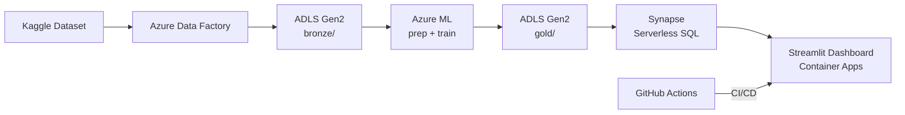

# Retail Credit Portfolio Analytics

A fully Azure-native retail credit risk dashboard built in Python.
Ingests LendingClub loan data, engineers features, trains a default-risk model,
and serves an interactive portfolio dashboard.

---

## Architecture

---

## Progress

| Step | Description | Status |
|------|-------------|--------|
| 1 | Azure environment setup | ✅ Done |
| 2 | Data ingestion (Kaggle → ADLS bronze) | ✅ Done |
| 3 | Data prep & feature engineering (bronze → silver) | ✅ Done |
| 4 | Model training — LR / XGBoost / LightGBM, winner to gold | ✅ Done |
| 5 | Synapse Serverless SQL views over gold layer | ✅ Done |
| 6 | Streamlit dashboard (7 chart types) | ✅ Done |
| 7 | Containerize dashboard (Docker → ACR) | ✅ Done |
| 8 | CI/CD pipeline (GitHub Actions → Container Apps) | ✅ Done |
| 9 | Monitoring (Azure Monitor + App Insights) | ✅ Done |
| 10 | GitHub showcase polish | ✅ Done |

---

## Tech Stack

| Layer | Technology |
|-------|-----------|
| Storage | Azure Data Lake Storage Gen2 |
| Ingestion | Azure Data Factory + Python |
| Preparation | Python, pandas, pyarrow |
| Modelling | scikit-learn, XGBoost, LightGBM, MLflow |
| Serving | Azure Synapse Analytics (Serverless SQL) |
| Dashboard | Streamlit, Plotly, Python |
| Hosting | Azure Container Apps |
| CI/CD | GitHub Actions |
| Secrets | Azure Key Vault |
| Auth | Azure Managed Identity |
| Monitoring | Azure Application Insights |

---

## Dataset

[LendingClub Loan Data 2007–2018](https://www.kaggle.com/datasets/wordsforthewise/lending-club)
— 1.3M closed loans, 20 features after engineering, 19.5% default rate.

---

## Key Resource Names

| Resource | Name |
|----------|------|
| Resource Group | `rg-retail-credit` |
| Storage Account | `stretailcreditrc01` |
| AML Workspace | `aml-retail-credit-rc01` |
| Synapse | `synw-retail-credit-rc01` |
| Key Vault | `kv-retail-credit-rc01` |
| Container Registry | `acrretailcreditrc01` |
| App Insights | `appi-retail-credit-rc01` |
